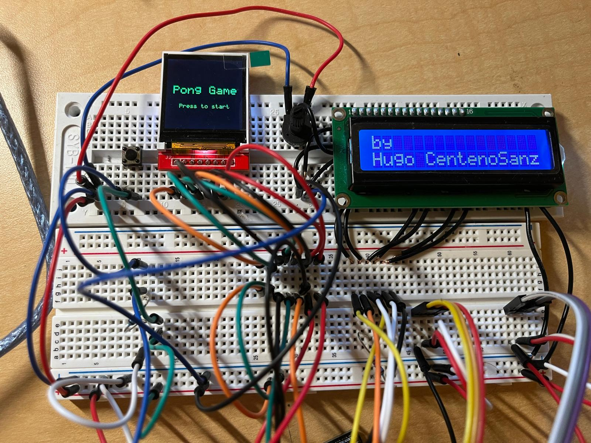
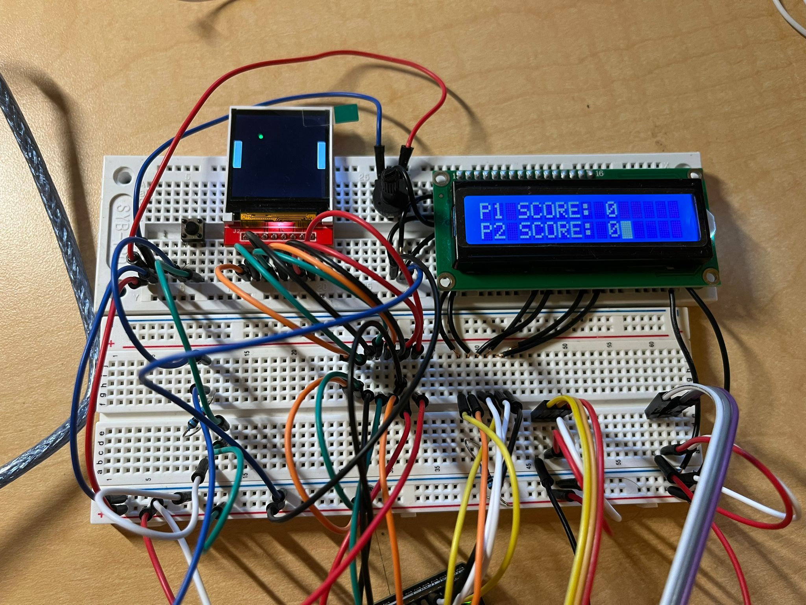
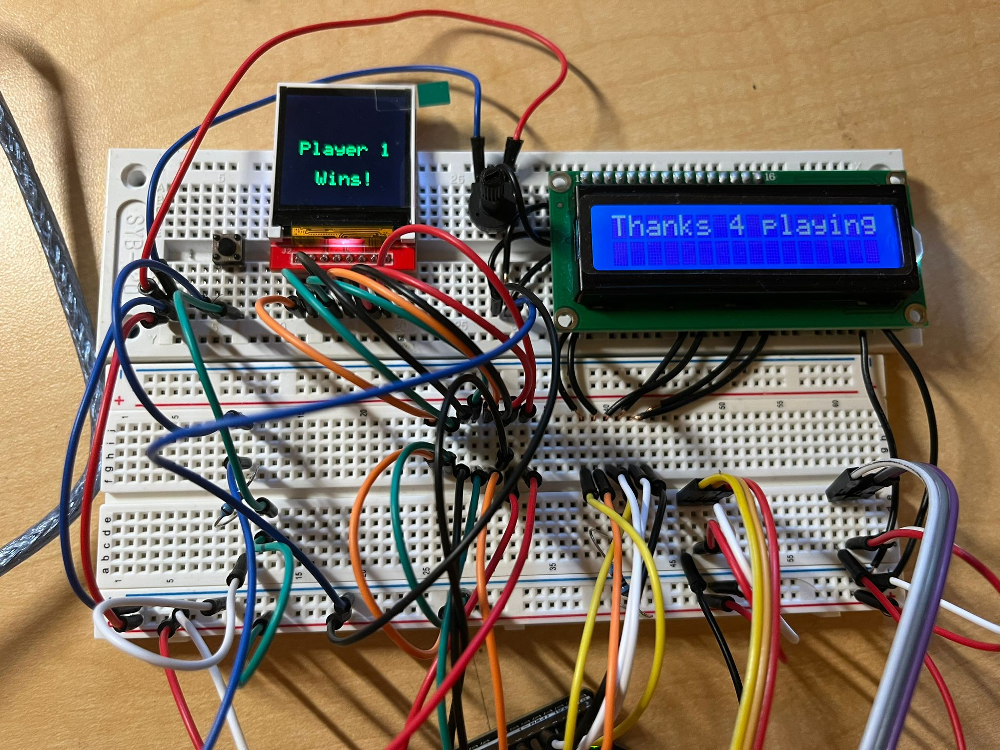

- ### Introduction
This project recreates the famous arcade game pong. Pong is a game where two players compete against each other by passing a ball which bounces on a paddle. A player scores a point if its shot is not able to be returned by the opposite player. The first player who reaches 5 points wins.

  

The players are first shown a wait screen. Once the button is pressed and released, the game begins.

  

While the game is being played, the current score is displayed on the secondary screen. When the game finishes the winner is displayed on the primary screen, and a message is displayed on the secondary screen.

  

- ### Hardware components used
    -Arduino UNO R3 Controller Board

    -ST7735 LCD  (used as primary screen)

    -LCD 1602 (used as secondary screen)

    -x2 Joysticks

    -Button

    -Resistance
- ### Wiring Connections
    - ST7735 LCD
    
            CS: D10
            RESET: D9
            A0: D8
            SDA: D11
            SCK: D13
            LED: 3.3V
    - LCD 1602

            V0: potentiometer
            RS: D2
            RW: GND
            E: D3
            D4: D4
            D5: D5
            D6: D6
            D7: D7
            A: 5V
            K: GND 

    - Joystick P1: A0

    - Joystick P2: A1

    - Button: A2

- ### Link to demo
https://www.youtube.com/watch?v=m41cJiF4xiA
